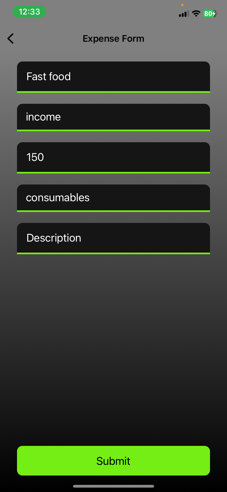

# Finance app using React Native (expo)
Expense Calculator App created using React Native Includes a form to add expenses and incomes, automatically calculating the total balance. conatins piechart to show payment details in the MonthDetailsScreen. 
app Developed in under 12 hours as part of a technical assessment to enter the mobile division at MDP and i have successed.
i have returned to this app to improve it and to fix some issues as the sqllite lib updated and i need to change the code for it to work.

## Used Libarys
react-hook-form for form mangement in ExpenseFormScreen
expo-sqlite for saving data localy
expo-linear-gradient for the gradient background
react-native-pie-chart for the piechart diagram
context for app wide state mangement as it is more convincing for small projects
navigation for easy screen navigations

## Home Screen

## Expense screen
 ### Empty form

 ### Filled form

## Old Doc
this is a finance App you can use this app to add your finance data and return a piechart diagram
app contains three pages
First page (homescreen) contains all the expenses and a small piechart
second page (addexpenses) contains a form to add the expenses
third page (month details) contain all the details of the card in the homepage but more detailed

first hour:

1. install dependencies for the project.
2. added context expenses
3. added all the screens

second & third hour:

1. added expenses component
2. added card component
3. some styling

forth & fifth hour:

1. added pieChartColorDetail
2. added piechartComponent

sixth to eighth hour:

1. adding sqlite.
2. bug fixes with the app state.